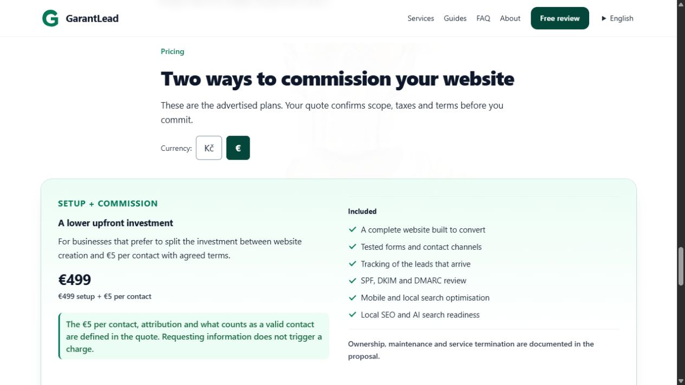
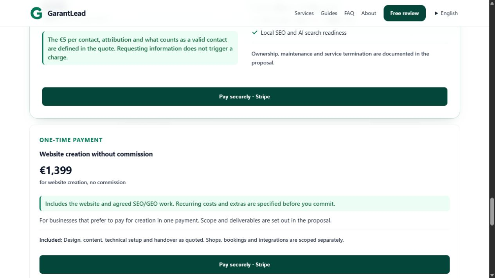
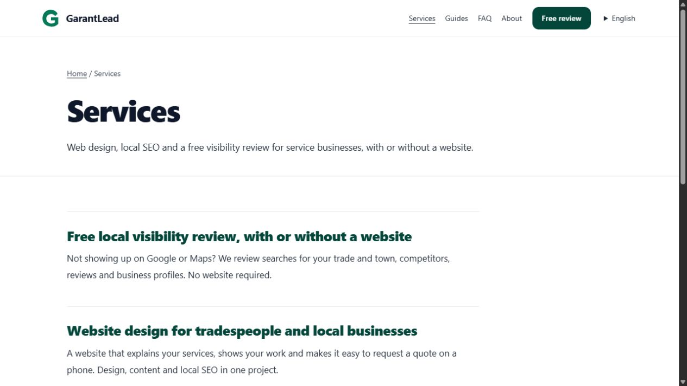
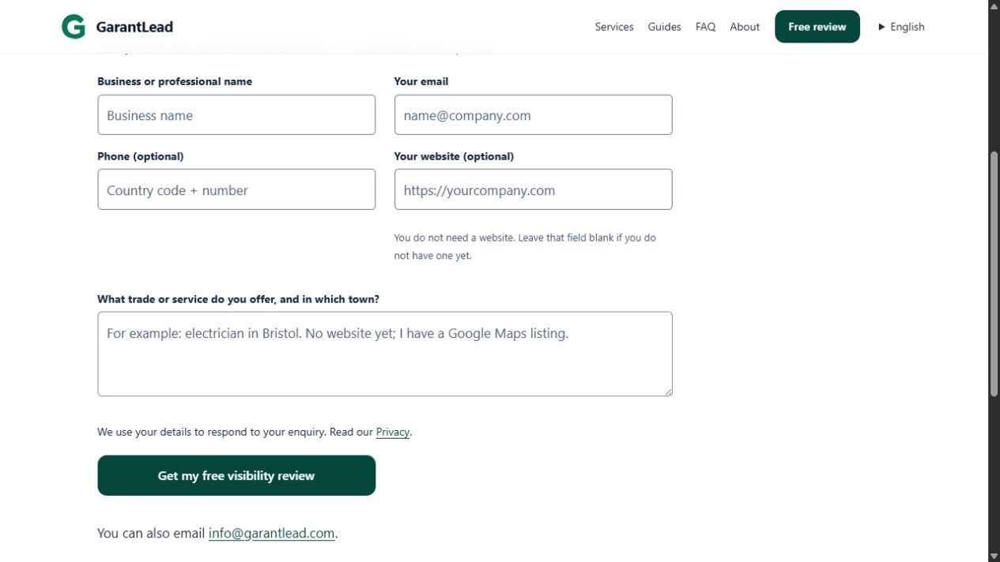
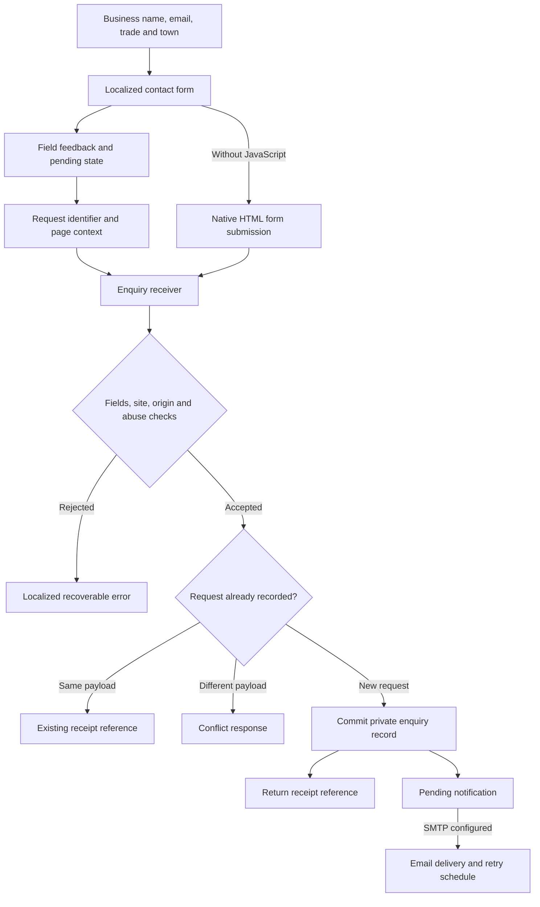
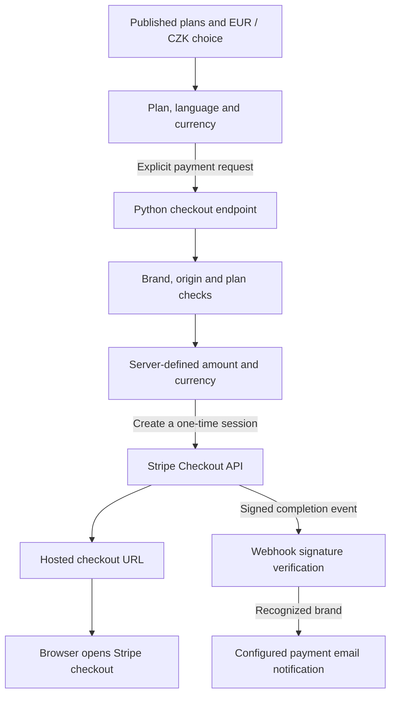
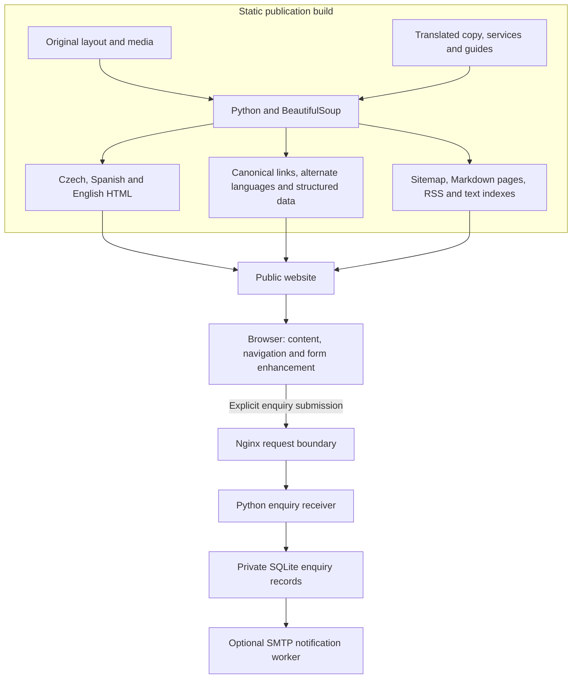

# GarantLead

### A multilingual website that connects local discovery with a recorded enquiry

GarantLead presents website design, local SEO and GEO services for tradespeople and local service businesses. Visitors can explore the offer in English, Spanish or Czech and request a visibility review with or without an existing website.

**[Explore the English website](https://garantlead.com/en/)** · **[Local visibility review](https://garantlead.com/en/services/local-visibility-review/)**

*Actual English homepage captured from the public website on 20 September 2026. It shows the current focused hero and free-review entry point.*

## From a local search to a useful conversation

A trades business may need a new website, clearer service pages or better information about its existing local presence. GarantLead organizes those needs into a concrete starting point: tell the team what the business does and where it works, then request a review of how customers can find it.

The review described on the site covers trade-and-town searches, Google and Maps listings, visible competitors, reviews, contact information and relevant local directories. Its GEO offer also considers the public business information available to AI search tools. These are services the website presents; the contact form does not run an instant automated ranking audit.

## The current website

| Area | What a visitor can explore |
|---|---|
| **Homepage** | The service proposition, visibility-review scope, contact journey, delivery approach and plans with a currency selector and payment entry points. |
| **Services** | Websites for tradespeople, local SEO, website audits and the free local visibility review. |
| **Guides** | Practical articles about enquiry problems and the structure of a website in three languages. |
| **FAQ and about** | Scope, working approach, commercial expectations and the relationship between GarantLead and its companion brand. |
| **Contact** | A business name, email and trade/town message, with optional phone and website fields. |
| **Privacy** | How language preferences and submitted enquiries are handled. |

Each language has its own page URLs and translated navigation. Service and guide pages link to related content and return visitors to the enquiry form.

*Actual English pricing section captured from the public website on 20 September 2026. The image shows the EUR/CZK selector and advertised setup-plus-commission option; no payment was initiated.*

*Actual English pricing section captured from the public website on 20 September 2026. It shows the separate one-time website-creation option and the Stripe entry buttons; neither button was activated.*

*Actual English services page captured from the public website on 12 September 2026.*

*Actual English contact page captured from the public website on 12 September 2026. No enquiry was submitted for this capture.*

## A contact form with a verifiable receipt

An accepted request becomes a private server record before the interface displays its reference. This keeps receiving an enquiry separate from notifying the business by email.

1. **Review the fields.** The browser highlights invalid inputs, focuses the first problem and keeps the visitor's text available for correction. Server-side validation checks the submitted values again.
2. **Submit a defined request.** The enhanced form attaches the page path and a request identifier. While submission is pending, the button is disabled and the form announces its busy state.
3. **Store before confirming.** The receiver validates the site and origin, applies abuse controls, and commits the enquiry to SQLite before returning a receipt reference.
4. **Handle uncertain responses.** A browser retry of the same payload reuses its request identifier. The receiver returns the existing reference; reusing that identifier with different content produces a conflict instead of replacing the enquiry.
5. **Notify separately.** An optional SMTP worker processes pending notifications and retries failures. The stored receipt does not depend on immediate email delivery.

The same endpoint supports JSON responses for the enhanced interface and a localized HTML response for a native form submission. Receipt and error pages are marked for exclusion from search indexing.

## From a selected plan to hosted checkout

The website now presents EUR and CZK options alongside its plans. The current implementation defaults Czech pages to CZK and English or Spanish pages to EUR, then remembers a visitor's currency choice separately for each language. The displayed amount and submitted currency change together.

An explicit payment request sends the selected plan, language and currency to the Python service. The service selects its own configured plan amount, creates a one-time Stripe Checkout session and returns the hosted checkout address. The browser then opens Stripe's payment page. The setup option collects the initial website fee; the alternative collects the one-time website-creation price. Usage-based charges are separate from that initial checkout.

The payment webhook verifies the event signature before attempting a brand-specific email notification. This is a separate path from the durable enquiry records and their retry worker. The implementation also contains a PaymentIntent endpoint; the inspected public-page script uses the hosted Checkout route. Payment credentials, successful transactions and notification delivery were not tested for this showcase. The static return page alone is not evidence that a payment succeeded.

## Three languages without a client-side translation dependency

The build produces complete Czech, Spanish and English HTML pages. Visitors receive the chosen language in the document itself, including headings, navigation, forms and metadata.

An unlocalized entry URL chooses a language in this order: an explicit language parameter, a remembered selection, then the browser's language preferences. Already localized URLs retain their language. The preference cookie records an intentional choice; the current routing implementation does not request visitor IP geolocation.

## How the site is built

Python combines the original page structure, translated content and reusable page components into the published site. BeautifulSoup transforms the homepage, while service and guide definitions generate the additional pages. Shared CSS and a small JavaScript layer provide the interface, form feedback and background-video behavior.

The public pages can be served as static files. The enquiry receiver has a separate responsibility and does not expose an administrative interface or stored requests through its public routes.

## Discovery is part of the publication process

The build creates canonical URLs and reciprocal language alternatives, plus structured descriptions of the organization, website and individual pages. Service pages describe their service; guides carry article metadata; FAQ pages include their questions and answers; internal pages include breadcrumbs.

The same page inventory feeds the sitemap, per-language guide feeds and Markdown/text indexes. These outputs make the published content available in several useful forms. They are not a guarantee of search ranking or AI recommendation.

## Data boundaries and implementation checks

Enquiry records live outside the public page tree. The receiver includes a honeypot, submission limits and a connection-derived abuse identifier. Its maintenance process removes old form records and expired rate-limit records. Email notification requires configured mail-service settings; receipt storage and email delivery remain distinct states.

The project includes checks for durable receipts, duplicate requests, changed-payload conflicts, invalid fields, localized errors, cross-site submissions and rate limiting. Build checks cover language metadata, reciprocal alternatives, links, form labels, structured data, sitemap coverage and preservation of original media. These checks were inspected for this showcase; no live enquiry was submitted during the review.

## Technology stack

| Layer | Technology and responsibility |
|---|---|
| Site generation | Python and BeautifulSoup transform layouts and translated content into static pages. |
| Interface | HTML, CSS and vanilla JavaScript, with content and native form behavior available without JavaScript. |
| Language routing | Python entry routing and a cookie for explicit language choices. |
| Enquiry service | Python HTTP receiver behind an Nginx boundary. |
| Persistence | SQLite enquiry records, request deduplication and rate-limit events. |
| Notifications | Optional enquiry SMTP delivery with a retry schedule; payment notifications use a separate webhook path. |
| Payments | Server-priced Stripe Checkout, EUR/CZK selection and signature-checked payment events. |
| Discovery outputs | JSON-LD, canonical and alternate-language links, sitemap, RSS, Markdown and text indexes. |

## About this repository

This repository showcases the current website, its actual interface and its implementation architecture. Source code, server configuration and customer enquiries remain private.

**Last showcase review:** 2026-09-20 (Europe/Paris).
