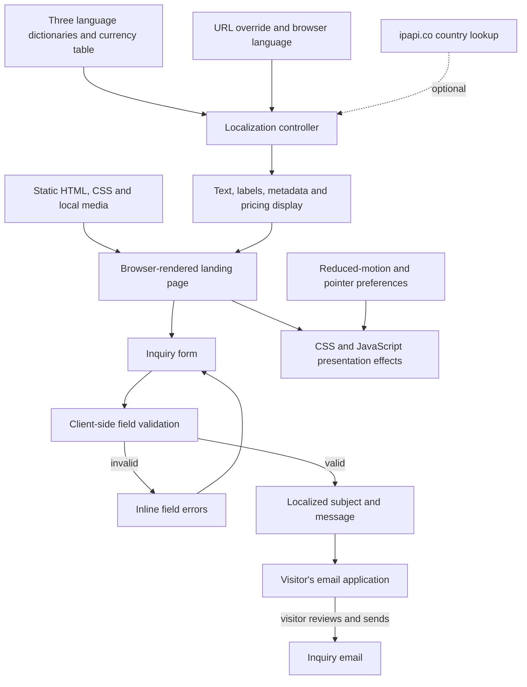

# GarantLead

### A multilingual front door for trades businesses that need a better website.

GarantLead presents a website-building service through a concrete visitor journey: understand the offer, inspect an example diagnosis, compare the two pricing approaches and prepare an inquiry. The page supports **Czech, Spanish and English**, with localized content and pricing displays.

## What the website does

- **Explains a focused service.** The page brings together website creation, inquiry handling, email setup, mobile usability and local discoverability in language aimed at trades businesses.
- **Shows what a diagnosis can look like.** A six-item sample report covers email configuration, form delivery, loading speed, telephone usability, business-profile completeness and local search visibility. The sample makes the service tangible without requiring a visitor to interpret a technical specification.
- **Compares two ways to buy the service.** Visitors can review a setup-plus-commission offer alongside a one-time payment offer, with their inclusions explained side by side.
- **Prepares an inquiry.** The form checks the visitor's details and opens an email draft containing the request. Sending remains a deliberate action in the visitor's email application.
- **Adapts the presentation.** Text, form hints, accessibility labels, document language and pricing displays are selected for the available language and market.

## From interest to an inquiry

| Step | Actual behavior |
| --- | --- |
| Understand the offer | Read the service sections and the website's sample diagnosis. |
| Compare the options | Review the two pricing models in the selected display currency. |
| Explain the starting point | Enter a name, email and phone number; the current website is optional. |
| Review and send | Correct any highlighted fields, then review the prepared message in an email application and send it manually. |

The form deliberately accommodates businesses that do not yet have a website. A missing website is valid; an entered address is checked before the message is prepared. Errors are attached to the relevant fields, and a live status message explains the email handoff.

## Language and market selection

The localization layer holds three dictionaries and four currency displays: CZK, EUR, USD and MXN. A language supplied in the page URL takes precedence, followed by supported browser-language settings and an optional country lookup. English is the fallback. A directed English link uses `?lang=en`.

The page applies translations to visible copy, placeholders, accessibility labels and metadata. Prices come from an explicit display table; they are not live exchange-rate calculations. If the optional country lookup fails or times out, the initially selected presentation remains available.

## How it is built

The site is delivered as static HTML, CSS, JavaScript and local media. Two browser-side paths handle its substantive interactions: localization and inquiry preparation.

| Layer | Implementation |
| --- | --- |
| Page structure | Semantic HTML sections, navigation, labeled inputs and sample-report markup |
| Presentation | Responsive CSS, local photography/video, focus styles and motion preferences |
| Localization | Vanilla JavaScript dictionaries, text substitution and market-selection rules |
| Inquiry handling | Browser validation and a localized email-app handoff |
| External dependency | Optional country lookup for presentation selection |

## Implemented scope

The current project is the service website and its browser interactions. The diagnosis displayed in the hero is a fixed example. The animated search questions illustrate the SEO/GEO proposition; they do not call an AI model. The site does not run an automated website audit, charge a payment or persist inquiries through a backend.

The responsive layout includes keyboard-focus styling, associated input errors, live status feedback and reduced-motion behavior. Those are concrete implementation choices; this showcase does not claim a measured conversion rate, a verified loading-time target or an accessibility certification.

## About this repository

This is the project's public showcase: an English explanation of the actual website, genuine page captures when available and an implementation-based architecture diagram. The application source and operational files remain private.

**Last showcase review:** 2026-09-12 (Europe/Paris).
