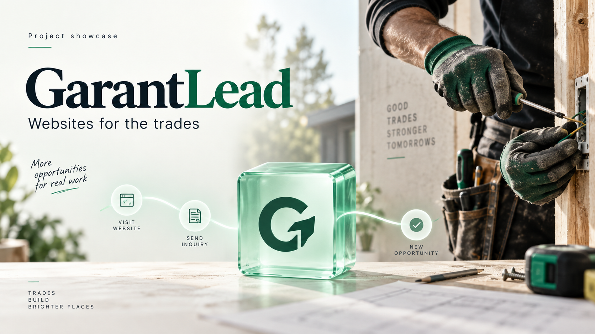
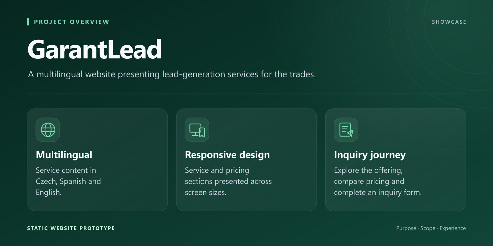
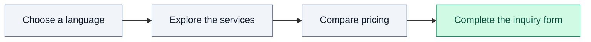

*Concept illustration created for this showcase.*

<h1>GarantLead</h1>

<strong>A multilingual website presenting lead-generation services for the trades.</strong>

  
  
  

## Purpose

GarantLead is a website project presenting lead-generation services for trades businesses. It brings service explanations, pricing information and an inquiry form into a clear, multilingual visitor journey.

The design combines trade-focused imagery with a restrained mint palette, subtle motion and CSS-based 3D branding. The emphasis is on explaining the offer and helping visitors understand their next step.

## Features

- Czech, Spanish and English website content.
- Responsive service and pricing sections.
- An inquiry form for prospective customers.
- Lightweight visual motion and a CSS 3D brand element.
- Content describing search visibility and local-business needs.

## Visual overview

## High-level workflow

The visitor journey connects the multilingual service proposition with pricing information and the inquiry form.

## Stack

HTML, CSS and JavaScript provide the website structure, presentation and multilingual behavior.

## Development status

Static website prototype focused on multilingual content, responsive presentation and the inquiry journey.

## About this repository

This repository is a public showcase. Only presentation material is published; source code and private data remain private.

**Last showcase review:** 2026-09-12 (Europe/Paris).
